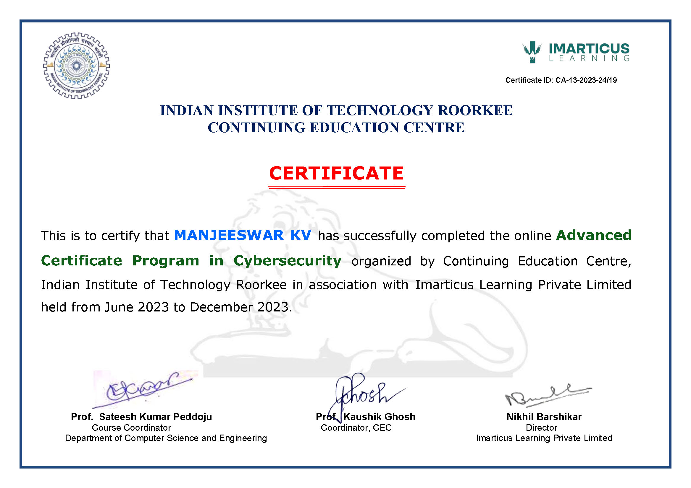

# Cybersecurity Portfolio

Welcome to my Cybersecurity Portfolio. This repository showcases my work in cybersecurity, focusing on incident response, security audits, system hardening, and vulnerability assessments. Each project demonstrates my experience in securing IT infrastructures and handling security breaches.

## About

This portfolio includes detailed reports on cybersecurity incidents and audits, showcasing my ability to identify, analyze, and mitigate security risks. My focus is on improving system resilience through incident response, vulnerability assessments, and post-breach hardening.

## Tools & Platforms

- **Tools**: Metasploit, Wireshark, Nmap, Burp Suite, Botium
- **Platforms**: Kali Linux, Windows Server, Linux

## Projects

- **Reports/**
  - **dns-incident-report.pdf**: Analysis of a DNS-based attack and recovery process.
  - **internal-it-audit-botium.pdf**: Security audit using Botium for automated testing.
  - **os-hardening-compromise-report.pdf**: Steps taken to harden an OS after a security breach.
  - **webserver-dos-summary.pdf**: Mitigation techniques for a Denial of Service attack on a web server.
  
- **certifications/**
  - **IIT_roorkee.jpg**: Certification from the Centre for Continuing Education, IIT Roorkee, acknowledging completion of relevant cybersecurity courses.  
    

- **Professional Statement/**
  - **professional-statement.pdf**: A document outlining my professional journey, objectives, and values in cybersecurity.

## Key Projects

- **DNS Incident Response**: A detailed report on detecting and responding to a DNS-based attack.  
  [Download PDF](Reports/dns-incident-report.pdf)

- **Internal IT Audit**: Security audit for an organization using Botium for vulnerability detection.  
  [Download PDF](Reports/internal-it-audit-botium.pdf)

- **OS Hardening After Breach**: Post-compromise hardening strategies to secure an OS and prevent future attacks.  
  [Download PDF](Reports/os-hardening-compromise-report.pdf)

- **Web Server DoS Mitigation**: Summary of strategies to mitigate a DoS attack on a web server.  
  [Download PDF](Reports/webserver-dos-summary.pdf)
